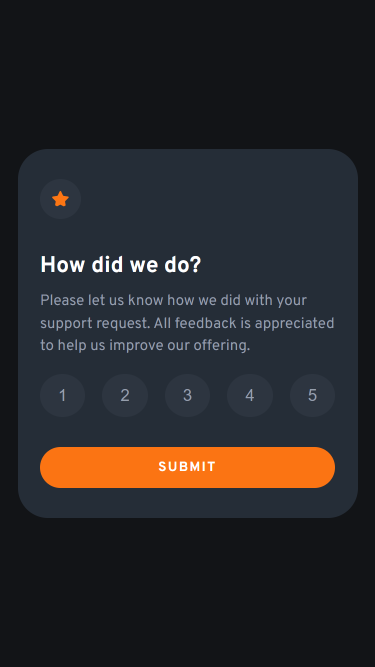

# Frontend Mentor - Interactive rating component

This is a solution to the [Interactive rating component challenge on Frontend Mentor](https://www.frontendmentor.io/challenges/interactive-rating-component-koxpeBUmI). A simple challenge to test your DOM manipulation skills.

## Table of contents

- [Frontend Mentor - Interactive rating component](#frontend-mentor---interactive-rating-component)
  - [Table of contents](#table-of-contents)
  - [Overview](#overview)
    - [The challenge](#the-challenge)
    - [Screenshot](#screenshot)
    - [Links](#links)
  - [My process](#my-process)
    - [Built with](#built-with)
    - [What I learned](#what-i-learned)
  - [Author](#author)

## Overview

### The challenge

Users should be able to:

-   View the optimal layout for the app depending on their device's screen size
-   See hover states for all interactive elements on the page
-   Select and submit a number rating
-   See the "Thank you" card state after submitting a rating

### Screenshot




### Links

-   Solution URL: [https://github.com/ChinatuL/Interactive-Rating-Component](https://github.com/ChinatuL)
-   Live Site URL: [https://chinatul.github.io/Interactive-Rating-Component/](https://your-live-site-url.com)

## My process

### Built with

-   Semantic HTML5 markup
-   CSS custom properties
-   Flexbox
-   Desktop-first workflow
-   JavaScript
    -   Arrow Functions
    -   Template Literals
    -   Event Listeners

### What I learned

One of the useful properties I learned in this project was how to use the JavaScript **classList** property to add/remove classes to elements.

```js
if (btn.classList.contains("btn-clicked")) {
    btn.classList.remove("btn-clicked");
    rateValue = 0;
}
```

## Author

-   Frontend Mentor - [@ChinatuL](https://www.frontendmentor.io/profile/ChinatuL)
-   Twitter - [@Chinatu Lucia](https://www.twitter.com/ChinatuLucia)
